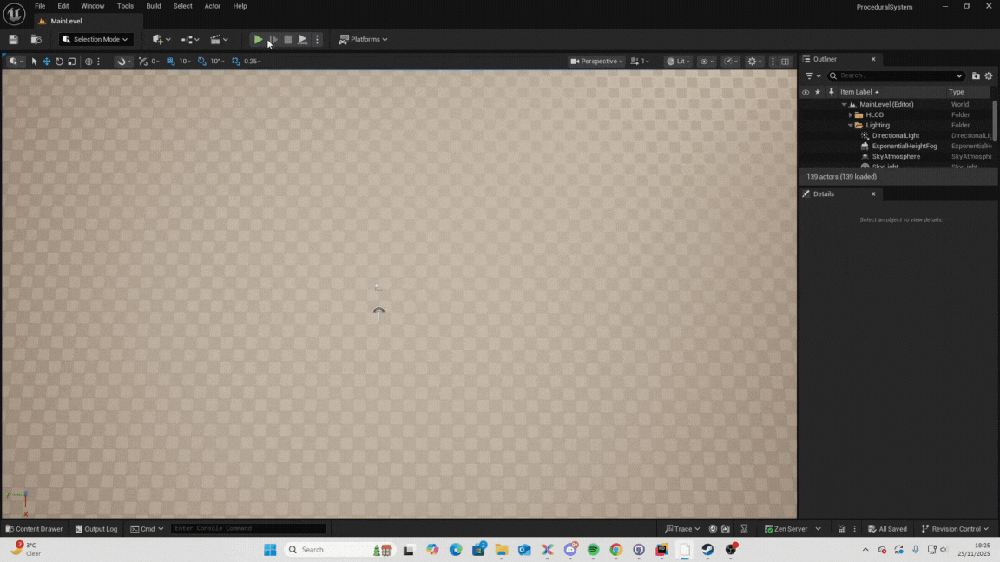

# Commentary

This project uses a Wave Function Collapse (WFC) algorithm in Unreal Engine 5, written in C++, to generate tile-based levels automatically. The system places tiles on a grid, making sure that each tile fits correctly with the tiles around it. This allows large patterns and layouts to be created without designing them by hand.

The system works by giving every grid cell a list of possible tiles it can use. Each tile has four socket values, one for each side: north, east, south, and west. These socket values define which tiles are allowed to be placed next to each other. At the start, every cell can use every tile.

During generation, the algorithm looks for the cell with the fewest valid tile options left. Choosing this cell first helps reduce mistakes later on. Once the cell is chosen, the system randomly picks one tile from its remaining options and locks it in place.

After a tile is placed, the system checks all neighboring cells. Any tile options that no longer fit, based on socket values, are removed from those neighbors. This update can continue spreading outward as each change may affect more cells. The process repeats until every cell has a tile, or until no valid tiles remain for a cell, which means the generation has failed.

Unreal Engine 5.6 is used to handle visuals, tile spawning, and timing. The generation runs over multiple frames using a timer so the game does not freeze while the grid is being built. C++ is used instead of Blueprints because it is faster when checking many tile combinations. Tile data, such as meshes and socket values, is stored in Data Tables, making it easy to change or add tiles without rewriting code.

The main rule of the system is socket matching. Two tiles can only be neighbors if the touching sides have the same socket value. Even though this rule is simple, it can create complex and interesting patterns. By always choosing the cell with the fewest options first, the system usually avoids conflicts and produces consistent results.

Everything in the system is procedural. No layouts or patterns are created by hand. The final result depends entirely on the tile rules and random choices made during generation. This makes the system flexible and easy to expand. It can be extended to 3D by adding vertical connections, or completely changed by using a different set of tiles.

To keep performance stable, the system limits how many times it can update neighboring cells in one step. Small grids can be generated instantly, while larger grids are built smoothly over time. Overall, this project shows how simple rules and constraints can be used to create varied and believable levels automatically.

